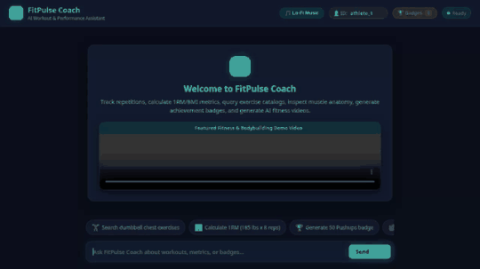

# 🏋️ FitPulse Coach - AI Workout & Performance Assistant

FitPulse Coach is an intelligent AI fitness agent built with Google's **Agent Development Kit (ADK)**, **Vertex AI Memory Bank**, **Google Cloud Firestore**, **Google Cloud Storage (GCS)**, **Imagen 3**, **Gemini Omni Video**, and **A2UI**.

It helps athletes track workout sets and reps, calculate One-Rep Max (1RM) and BMI metrics, search exercise catalogs, inspect muscle anatomy diagrams, generate achievement badges, and synthesize AI fitness videos.



---

## ⚡ Wired Capabilities & Google Cloud Integrations

Based on the codebase in `app/` and `agents-cli-manifest.yaml`, FitPulse Coach integrates the following Google Cloud services and tools:

### 🧠 1. Cross-Session Long-Term Memory
- **Vertex AI Memory Bank**: Integrates `PreloadMemoryTool` and Vertex AI Memory Bank (`projects/qwiklabs-gcp-03-4842e70d567f/locations/us-east1/reasoningEngines/8162226767818391552`) to remember user workout history, preferences, and goals across sessions.

### 💾 2. Persistent Database Storage
- **Google Cloud Firestore**: Persists user workout entries, set/rep logs, and timestamps via `log_workout_entry` in the `qwiklabs-gcp-03-4842e70d567f` GCP project.

### 🖼️ 3. AI Badge Image Generation & Public Storage
- **Gemini Imagen 3 / GCS**: `generate_workout_badge_image` generates custom workout achievement badges using Vertex AI image generation (`imagen-3.0-generate-002` / `gemini-3.1-flash-lite-image`), uploads the bytes directly to a public GCS bucket (`fitpulse-coach-public-4842e70d567f`), and returns the public HTTPS URL.

### 🎥 4. AI Video Generation
- **Gemini Omni Video (`gemini-omni-flash-preview`)**: `generate_fitness_video` synthesizes 5-second cinematic workout videos in the `global` region, saves artifacts via `tool_context.save_artifact`, uploads bytes to GCS, and returns direct video streaming URLs.

### 🎨 5. Agent Development Kit (ADK) & A2UI Cards
- **A2UI Schema Manager (v0.8 Basic Catalog)**: Formats response payloads into rich visual display cards (headings, columns, rows, images, and dividers) rendered directly in the custom FastAPI frontend.

### 📊 6. Fitness Calculators & Exercise Utilities
- **`calculate_fitness_metrics`**: Computes estimated One-Rep Max (Epley formula) and BMI metrics.
- **`search_exercise_catalog`**: Queries structured exercise instructions by muscle group and equipment.
- **`get_muscle_anatomy_info`**: Returns targeted muscle group diagrams and action details.

---

## 🛠️ Project Structure

```
fitpulse-coach/
├── app/                      # ADK Agent Code
│   ├── agent.py              # Root agent, tools, callbacks, & A2UI manager
│   ├── a2ui_utils.py         # A2UI event & message schema helper
│   └── __init__.py
├── frontend/                 # Web Application Frontend & Proxy
│   ├── main.py               # FastAPI proxy server (A2A protocol)
│   └── static/               # HTML5 UI, marked.js, audio, and styling
│       ├── index.html        # Athletic dark theme UI & badge gallery
│       └── lofi_music.wav    # Upbeat lo-fi background audio track
├── demo.gif                  # Inline looping demo recording
├── record_demo.py            # Playwright browser demo recorder
├── agents-cli-manifest.yaml  # Agent deployment configuration
└── README.md
```

---

## 🚀 Setup & Local Execution Instructions

To run FitPulse Coach locally on your workstation:

### 1. Install Dependencies
Ensure `uv` and Python 3.11+ are installed:
```bash
uv pip install -r frontend/requirements.txt
```

### 2. Set Environment Variables
Set your Agent Engine resource name and agent directory:
```bash
export AGENT_ENGINE_RESOURCE_NAME="projects/673706048933/locations/us-east1/reasoningEngines/3229518538452500480"
export AGENT_DIRECTORY="app"
```

### 3. Start the Web Server
Run the FastAPI proxy server from the `frontend/` directory:
```bash
cd frontend
uv run python main.py
```

The web app will start on port `8080`. Open your browser locally to interact with FitPulse Coach.
